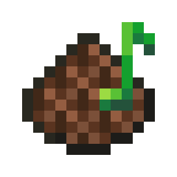

# Overture

Overly customizable playing media overlay.

## Notes

- Direct Spotify integration has been omitted due to [recent changes requiring Premium for access to the Web API](https://developer.spotify.com/blog/2026-02-06-update-on-developer-access-and-platform-security)
  - Feel free to ask for any further integrations
- macOS is not supported at the moment; I don't have access to a device that runs it

## Contributing

- If you change anything with the Windows native, make sure you have `msbuild` installed and use the `compileWindowsNative` task